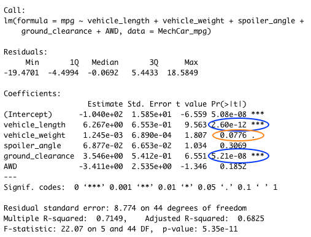
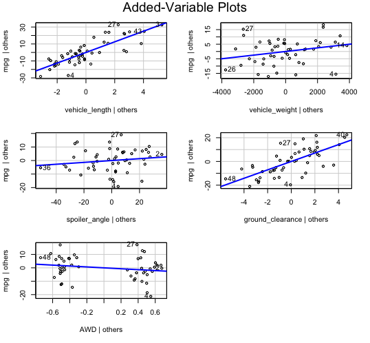
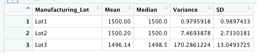
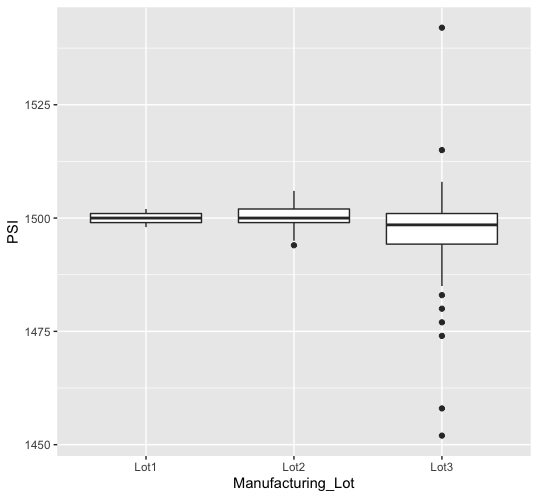
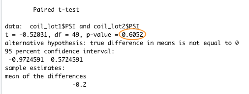
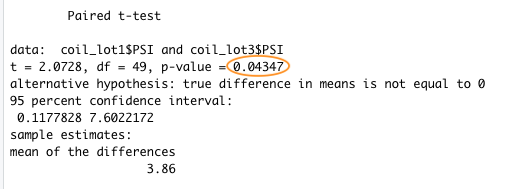
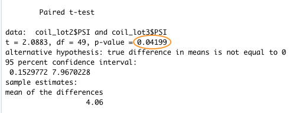
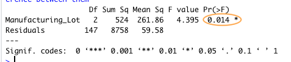
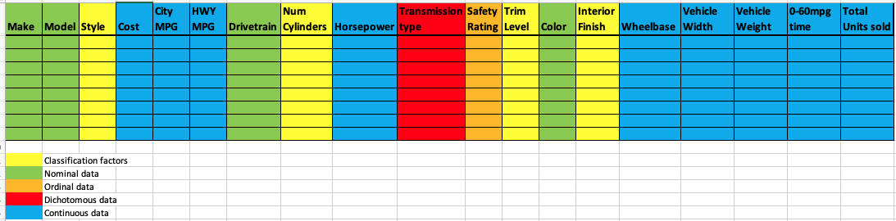
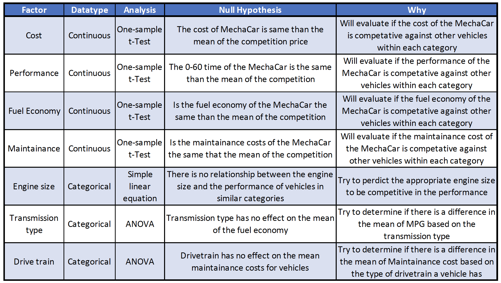

# MechaCar Statistical Analysis

## Overview

This is an overview of the methodologies for the analysis of vehicle characteristics and quality control elements in the development of a new automobile into the current market.  It includes some predictions for the fuel efficiency based on linear regression with some vehicle specification and summary statistics on parts to aid in quality control.  Testing for variations on part lots is conducted using hypothesis testing through T-tests and ANOVA to determine the consistency of part performance.  Finally, a design for the statistical analysis to estimate the success of the new product based on key factors that will determine how the new product will perform in comparison to other products on the market.

---

## Linear Regression to Predict MPG

To help developers determine how design elements will impact the vehicle fuel efficiency.  To evaluate this a dataset of 50 vehicles was used to complete a linear regression analysis of 5 vehicle characteristics compared to the resulting fuel economy in MPG.  Below the results of this analysis are presented:

From this analysis it is evident that the there is a significant positive correlation between the length of the vehicle and the height of the vehicle as it relates to a higher MPG.  The vehicle weight has a smaller positive effect at a significance level of 95% with fuel economy.  These values would be of particular interest in the design and development of the car.  To illustrate the relationship between each coefficient and the MPG fuel efficiency, graphs of the variance of each coefficient is presented in the image below.

From these images it is evident that the slope of each regression line shows the relationship between the coefficients and MPG.  None of the lines are perfectly horizontal which would indicate a completely random relationship between each factor and MPG.  However, the coefficients with significant correlation with fuel efficiency have a distinct angled slope to the regression line.

The linear regression models that this analysis shows would not be successful at predicting accurately the fuel economy of the MechaCar prototypes as the correlation coefficient of 68% indicates that this model only accounts for 68% of the predicted MPG based on the information analyzed.  This means that 32% of the resulting MPG is not contained within the factors provided.  

---

## Summary Statistics on Suspension Coils

In the development of the new concept car, quality control of the components that make the vehicle is paramount to the overall consistency of the end product.  To help develop a model for analysis of the parts that are being installed comparisons of the part lots supplied by the vendors can help validate the consistency of the products being supplies.  To illustrate this, a dataset containing the compression date for suspension springs that are being used on the prototype was used to present how statistical analysis can be completed on the data to give some insight into the consistency observed.  The first analysis to be completed was to collect and display the summary statistics for all the data and between each lot value to ensure that the spring variance does not exceed the 100 PSI that is required by the manufacturer.  The results are presented below:

The summary statistics show that when the total set of springs are evaluated to show the mean, median, variance and SD, the springs meet the maximum 100 PSI variance required by the manufacturer.  As seen in the summary of the whole dataset the springs appear to meet the manufacturing quality guidelines with a variance of 63.3 PSI for all coils however when the analysis is done for each lot we can observe that Lot 3 does not meet the criteria and should be recalled.  As observed in the table above the variance observed in lot 3 was 170.3 which 70% higher than the maxiumum variance acceptable from the manufacturer.  This is compared to the various observed in lots 1 and 2 which were .98 and7.47 respectively. 

This is further illustrated in the box plots of the data for each plot which clearly shows a wide distribution of compression values with a number of outliers which suggest a high amount of variability in the spring in that lot as compared to the tight cluster of data observed in lots 1 and 2.

## T-Test and ANOVA on Suspension Coils

### T-Test of Lots Against Population mean

It has been established that the population mean of the coil compression is a value of 1500 PSI for which all data can be compared against to ensure they are within an acceptable range.  To do this, t-Tests of the means of the samples collected can be compared against the population mean.  If the p-values calculated from these the one sample t-Test is above the 95% confidence level (0.05) the null hypothesis that the value is different from the population mean of 1500 can be rejected.  

The initial analysis was to determine if the total sample of the coil compression data was compared against the population mean.  As seen below the p-value from the analysis of 0.061 is higher than the 0.05 confidence value which results in the rejection of the null hypothesis that the lot values differ from the population mean.  This is similar to the findings observed in the summary statistics presented in the previous section.

As we observed large differences in the variations between lots, t-tests for the mean of the compression values for each lot against the population mean can determine if there are significant differences observed.  As seen below in the individual t-Tests, the p-values for lot 1 and lot 2 were greater than the 0.05 confidence values allow the rejection of the null hypothesis that they differ from the population mean.  Lot 3 however had a p-value of 0.046 which results in an acceptance of the null hypothesis and indicating that that lot varies significantly form the population mean.

### T-Tests Between Lots

With the analysis of the mean and variance observed in the various lots studied a t-Test was conducted to determine if there is a statistically significant difference between the means of the compression observed between the lots.  To complete this each lot was compared to each other to test the significance of the difference between the means. As seen in the data below in the t-Test conducted between lot 1 and lot 2 the p-value of 0.6283 is larger than the confidence interval 0.05 which indicates that there is no statistical difference between the means of the two lots.  

When looking at the T-Test conducted of lot 3 against lot 1 and lot 2, the p-values were lower than the confidence interval of 0.05 for both tests.  This mean we can determine that the mean of the compression values in lot 3 were significantly different that those observed in lot 1 and lot 2.  This confirms the significance of the variation observed in the summary statistics presented for each lot showing the high variance in lot 3.

### ANOVA

The analysis of variance of the compression data for each lot confirms the analysis using the T-Tests for each lot in the study.  The ANOVA show that there is significant variance between the lots as seen in the ANOVA table below.  This confirms that there is a significant variance observed between lot values.  As the analysis of the factors is greater than 2 (3 lots in total) an ANOVA test reduces the Type 1 error by comparing all data against each other rather than individual T-Test which confounds the chance of Type 1 error for each test completed. Validation using the ANOVA confirms the significance of the finding of the T-Test and increases our confidence in the conclusions that can be made.

---

## Study Design: MechaCar vs Competition

To determine the potential success of the MechaCar to the current competition data for vehicles in similar categories should be collected to allow for a comprehensive analysis to determine if the MechaCar models have a competitive advantage based on the vehicle characteristics.  To ensure that the data is representative, a number of categorical factors must be collected to ensure that the vehicles being compared are in a similar category and a fair comparison can be made.  Examples of this could include vehicle type or style to ensure we are not comparing a compact car to a truck or full size model.  Similarly, options such as trim type and interior material should be factored in when comparing prices.  An example of the data that could be considered can be seen in the table mockup below.  The data types are shown including some of the categorical factors that can be used to place similar type vehicles together to ensure that the analysis gives meaningful conclusions.

Some key factors for consumers would consider the following:

- Fuel economy
- Performance
- Safety rating
- Maintenance costs
- Cost

The factors listed above are not a complete list but are factors that should be considered when evaluating the new vehicle. Though not an exhaustive list the table below gives some examples of the analysis that can be completed on the data to determine how the MechaCar measures up to the competition base on the analysis of the data collected.  It is important to note that the larger the dataset that can be tested against the MechaCar data the more confident we can be on the conclusions being made.

